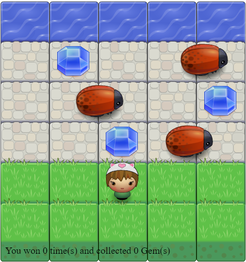

# Classic Arcade Game Clone Project

## What is this Game?

A fun game that challenges you to collect the gems then reach the water area without being hitted by a bug.

## Running the game

Run the game locally by opening index.html in a browser.

## How to play

To play the game you should use arrow keys to move the player to avoid the enemies and
reach the water.

## Contributing

This repository is the starter code for _all_ Udacity students. Therefore, we most likely will not accept pull requests.
